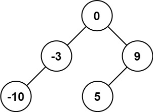

# 108. Convert Sorted Array to Binary Search Tree
`Easy`

Given an integer array `nums` where the elements are sorted in ascending order, convert it to a height-balanced binary search tree.

## Examples

**Example 1:**

```
Input: nums = [-10,-3,0,5,9]
Output: [0,-3,9,-10,null,5]
Explanation: [0,-10,5,null,-3,null,9] is also accepted.
```


**Example 2:**

```
Input: nums = [1,3]
Output: [3,1]
Explanation: [1,null,3] and [3,1] are both height-balanced BSTs.
```

## Constraints

- `1 <= nums.length <= 10^4`
- `-10^4 <= nums[i] <= 10^4`
- `nums` is sorted in a strictly increasing order.
